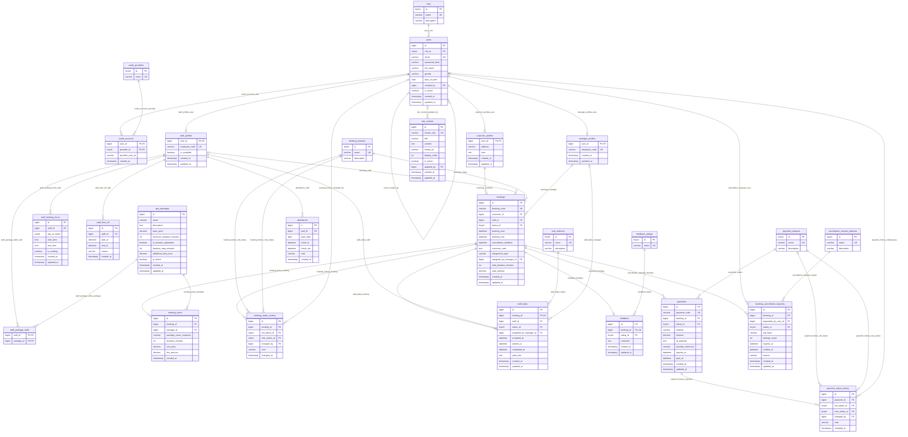

# ERD — Database Schema v1

ERD này đồng bộ với `Schema.md` và `schema.dbml`.

```mermaid
erDiagram
    roles {
        tinyint id PK
        varchar name UK
        varchar description
    }
    users {
        bigint id PK
        tinyint role_id FK
        varchar email UK
        varchar password_hash
        varchar full_name
        varchar gender
        date date_of_birth
        bigint created_by FK
        boolean is_active
        timestamp created_at
        timestamp updated_at
    }
    oauth_providers {
        tinyint id PK
        varchar name UK
    }
    oauth_accounts {
        bigint user_id PK,FK
        tinyint provider_id PK,FK
        varchar provider_user_id
        timestamp created_at
    }
    customer_profiles {
        bigint user_id PK,FK
        varchar address
        text note
        timestamp created_at
        timestamp updated_at
    }
    staff_profiles {
        bigint user_id PK,FK
        varchar employee_code UK
        boolean is_available
        timestamp created_at
        timestamp updated_at
    }
    manager_profiles {
        bigint user_id PK,FK
        varchar employee_code UK
        timestamp created_at
        timestamp updated_at
    }
    spa_packages {
        bigint id PK
        varchar name
        text description
        decimal base_price
        int minimum_duration_minutes
        boolean is_duration_adjustable
        int duration_step_minutes
        decimal additional_step_price
        boolean is_active
        timestamp created_at
        timestamp updated_at
    }
    staff_package_skills {
        bigint staff_id PK,FK
        bigint package_id PK,FK
    }
    staff_working_hours {
        bigint id PK
        bigint staff_id FK
        tinyint day_of_week
        time start_time
        time end_time
        boolean is_working
        timestamp created_at
        timestamp updated_at
    }
    staff_time_off {
        bigint id PK
        bigint staff_id FK
        datetime start_at
        datetime end_at
        varchar reason
        timestamp created_at
    }
    booking_statuses {
        tinyint id PK
        varchar name UK
        varchar description
    }
    bookings {
        bigint id PK
        varchar booking_code UK
        bigint customer_id FK
        bigint staff_id FK
        tinyint status_id FK
        datetime booking_start
        datetime booking_end
        datetime cancellation_deadline
        text customer_note
        varchar assignment_type
        bigint assigned_by_manager_id FK
        int total_duration_minutes
        decimal total_amount
        timestamp created_at
        timestamp updated_at
    }
    booking_items {
        bigint id PK
        bigint booking_id FK
        bigint package_id FK
        varchar package_name_snapshot
        int duration_minutes
        decimal unit_price
        decimal line_amount
        timestamp created_at
    }
    booking_status_history {
        bigint id PK
        bigint booking_id FK
        tinyint old_status_id FK
        tinyint new_status_id FK
        bigint changed_by FK
        varchar note
        timestamp changed_at
    }
    task_statuses {
        tinyint id PK
        varchar name UK
        varchar description
    }
    staff_tasks {
        bigint id PK
        bigint booking_id FK,UK
        bigint staff_id FK
        tinyint status_id FK
        bigint assigned_by_manager_id FK
        datetime accepted_at
        datetime started_at
        datetime completed_at
        text staff_note
        timestamp created_at
        timestamp updated_at
    }
    feedback_ratings {
        tinyint id PK
        varchar name UK
    }
    feedback {
        bigint id PK
        bigint booking_id FK,UK
        tinyint rating_id FK
        text comment
        timestamp created_at
        timestamp updated_at
    }
    attendance {
        bigint id PK
        bigint staff_id FK
        date work_date
        datetime check_in
        datetime check_out
        varchar note
        timestamp created_at
    }
    site_content {
        bigint id PK
        varchar section_key UK
        varchar title
        text content
        varchar media_url
        int display_order
        boolean is_active
        bigint updated_by FK
        timestamp created_at
        timestamp updated_at
    }
    payment_statuses {
        tinyint id PK
        varchar name UK
        varchar description
    }
    payments {
        bigint id PK
        varchar payment_code UK
        bigint booking_id FK
        tinyint status_id FK
        varchar method
        decimal amount
        text qr_payload
        varchar provider_reference
        datetime expires_at
        datetime paid_at
        timestamp created_at
        timestamp updated_at
    }
    payment_status_history {
        bigint id PK
        bigint payment_id FK
        tinyint old_status_id FK
        tinyint new_status_id FK
        bigint changed_by FK
        varchar note
        timestamp changed_at
    }
    cancellation_request_statuses {
        tinyint id PK
        varchar name UK
        varchar description
    }
    booking_cancellation_requests {
        bigint id PK
        bigint booking_id FK
        bigint requested_by_user_id FK
        tinyint status_id FK
        varchar otp_hash
        int attempt_count
        datetime expires_at
        datetime verified_at
        varchar reason
        timestamp created_at
        timestamp updated_at
    }
    roles ||--o{ users : "users_role"
    users o|--o{ users : "users_created_by"
    users ||--o{ oauth_accounts : "oauth_accounts_user"
    oauth_providers ||--o{ oauth_accounts : "oauth_accounts_provider"
    users ||--o| customer_profiles : "customer_profiles_user"
    users ||--o| staff_profiles : "staff_profiles_user"
    users ||--o| manager_profiles : "manager_profiles_user"
    staff_profiles ||--o{ staff_package_skills : "staff_package_skills_staff"
    spa_packages ||--o{ staff_package_skills : "staff_package_skills_package"
    staff_profiles ||--o{ staff_working_hours : "staff_working_hours_staff"
    staff_profiles ||--o{ staff_time_off : "staff_time_off_staff"
    customer_profiles ||--o{ bookings : "bookings_customer"
    staff_profiles o|--o{ bookings : "bookings_staff"
    booking_statuses ||--o{ bookings : "bookings_status"
    manager_profiles o|--o{ bookings : "bookings_manager"
    bookings ||--o{ booking_items : "booking_items_booking"
    spa_packages ||--o{ booking_items : "booking_items_package"
    bookings ||--o{ booking_status_history : "booking_history_booking"
    booking_statuses o|--o{ booking_status_history : "booking_history_old_status"
    booking_statuses ||--o{ booking_status_history : "booking_history_new_status"
    users o|--o{ booking_status_history : "booking_history_changed_by"
    bookings ||--o| staff_tasks : "staff_tasks_booking"
    staff_profiles ||--o{ staff_tasks : "staff_tasks_staff"
    task_statuses ||--o{ staff_tasks : "staff_tasks_status"
    manager_profiles o|--o{ staff_tasks : "staff_tasks_manager"
    bookings ||--o| feedback : "feedback_booking"
    feedback_ratings ||--o{ feedback : "feedback_rating"
    staff_profiles ||--o{ attendance : "attendance_staff"
    users o|--o{ site_content : "site_content_updated_by"
    bookings ||--o{ payments : "payments_booking"
    payment_statuses ||--o{ payments : "payments_status"
    payments ||--o{ payment_status_history : "payment_history_payment"
    payment_statuses o|--o{ payment_status_history : "payment_history_old_status"
    payment_statuses ||--o{ payment_status_history : "payment_history_new_status"
    users o|--o{ payment_status_history : "payment_history_changed_by"
    bookings ||--o{ booking_cancellation_requests : "cancellation_requests_booking"
    users ||--o{ booking_cancellation_requests : "cancellation_requests_user"
    cancellation_request_statuses ||--o{ booking_cancellation_requests : "cancellation_requests_status"
```
